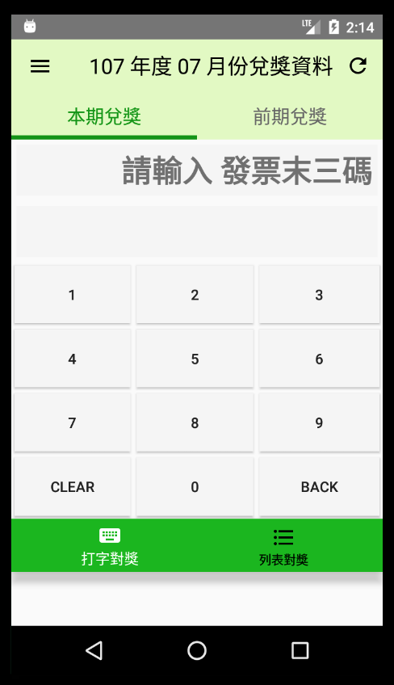
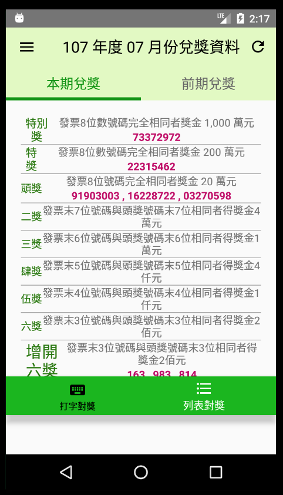

# Taiwans-receipt-lottery 簡單發票對獎系統( 版本1.0 )

[](https://play.google.com/store/apps/details?id=com.webronin_26.taiwans_receipt_lottery_application_release)
<a href="https://play.google.com/store/apps/details?id=com.webronin_26.taiwans_receipt_lottery_application_release" target="_blank"></a>



這是一個發票對獎的 Application
<br/>簡單使用，方便對獎！
<br/>可以使用輸入發票後三碼，或是用列表自行對獎！😊

## Application 介紹
* [適用版本&library支援版本](#適用版本&library支援版本)
* [使用路徑User-Story](#使用路徑User-Story)
* [Libraries](#Libraries)

## 適用版本&library支援版本

目前本 Application 支援版本：Android 4.4( API 19 ) 至  Android 8.0( API 26 )
<br/>
<br/>其餘 library 支援版本如下：
1. FireBase : Android 4.0(API level 15) or newer, and Google Play services 15.0.0 or higher.
2. support:appcompat-v7 : Android 2.1(API level 7)or newer
3. Crashlytics : Android 2.2(API level 8)or newer
4. Google Play services :  Android 4.0 (API level 14) or newer
5. Admob :  Android 4.0 or higher( 本 Application 開發時支援至 API 26 ) 

## 使用路徑User-Story

### 之前沒有儲存資料 ( 前台更新 )( Ex : 第一次使用 )
```
進入頁面，跳出 ProgressDialog 跑更新畫面

最多等待四秒，如果沒有網路  --> 跳出 SnackBar 告知用戶開啟網路
                            這個狀態之下：
                            按下 BottomNavigationView / TabLayout / DrawerLayout 正常跳轉頁面，但無資料
                            按下螢幕上的數字按鍵會出現 SnackBar 通知用戶要開啟網路
                            按下 更新按鈕，將會重複剛剛的更新步驟
                            按下 home / ScreenLock 後再次進入這個頁面，同樣進入剛剛的更新步驟

最多等待四秒，如果這之間有網路 --> (app版本過舊)-->  跳出 AlertDialog 更新通知
                                          --> ( 取消 ) 跳出 App
                                          --> ( 確定 ) 拉到 google play 本 App 頁面讓使用者進行更新動作

                          --> ( 版本正常 ) --> 結束 ProgressDialog 跳出 Toast "已經是最新資料"
                                              TextView 顯示 "請輸入 發票末三碼"，這樣就可以開始使用了
```

### 之前有儲存資料 ( 後台更新 )( Ex : 前一次有使用過，有儲存過資料 )
```
進入頁面
這時使用者已經可以用上次下載的資料正常使用，更新步驟將在背景執行

背景最多更新四秒，如果沒有網路    --> 跳出 SnackBar 告知用戶開啟網路，這個狀態之下仍然可以使用各功能
                                ( 除了 DrawerLayout 跳轉 google play 頁面之外 )

背景最多更新四秒，如果這之間有網路 --> (app 版本過舊) -->  跳出 AlertDialog 更新通知
                                           --> ( 取消 ) 跳出 App
                                           --> ( 確定 ) 拉到 google play 本 App 頁面讓使用者進行更新動作

                              --> ( 現有資料過舊 ) --> 跳出 "已有更新資料，請更新"
                                                    -—> 確認，跑前台更新
                                                    -—> 拒絕，繼續使用舊資料

                              --> ( 都沒問題 )  --> 跳出 Toast "已經是最新資料"
```

### 正常頁面使用
```
1. 輸入發票後三碼，按下數字鍵，會出現在 第一個 TextView 上，輸入長度到達三的時候
   第二個 TextView 會出現 是否中獎了
   按下 back ，會刪掉最近輸入的數字，如果長度為零，會出現 "請輸入發票後三碼"
   按下 clear，會刪掉所有出現的數字，並且出現 "請輸入發票後三碼"

2. 按下 更新按鈕，將進行 前台更新步驟

3. 按下 DrawerLayout Bottom 抽出 DrawerLayout
   有兩個選項 --> 按下 查看版本 --> Toast 出目前版本
            --> 按下 給我評分 --> 跳轉到 google play 本 App 頁面

4. 按下 TabLayout，跳轉 本次 和 前次 的兌獎畫面
   上方的 ToolBar 會顯示是幾月份的資料

5. 按下 bottomNavigation，跳轉 是使用 輸入兌獎 還是列表對獎
```

## Libraries
使用到的 Library 為
* Support Library
* Dagger 2
* Crashlytics
* Analytics
* ButterKnife
* Firebase
* AdMob
* Leakcanary
* Mockito
* Junit
* Robolectric
* Fragment-test-rule
* Espresso
